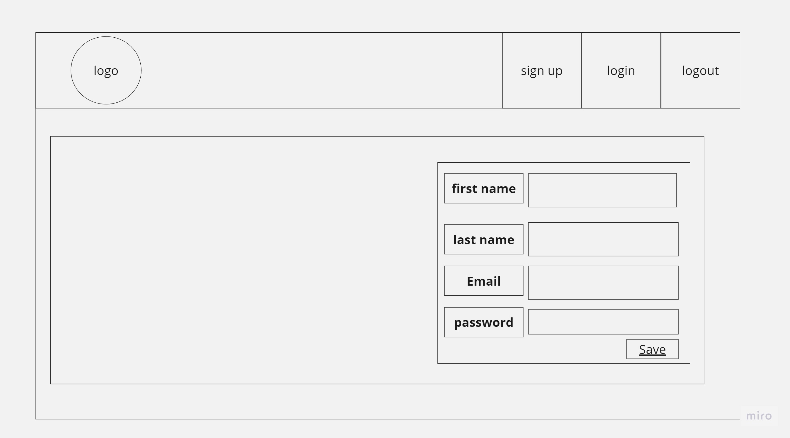
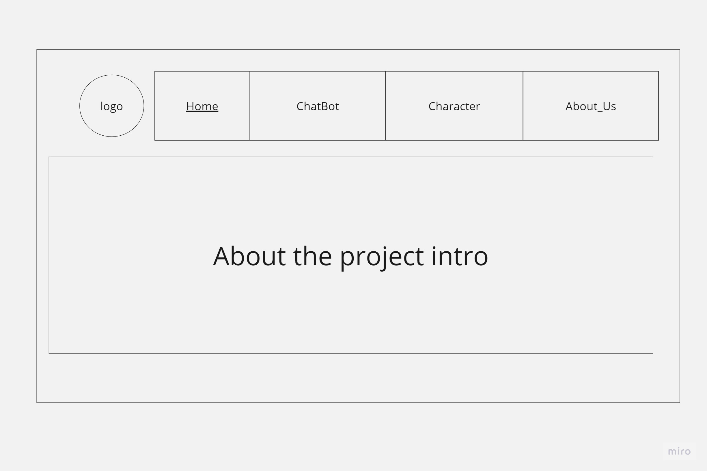
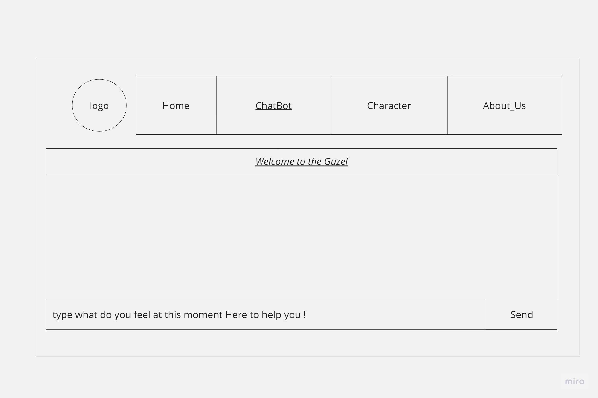
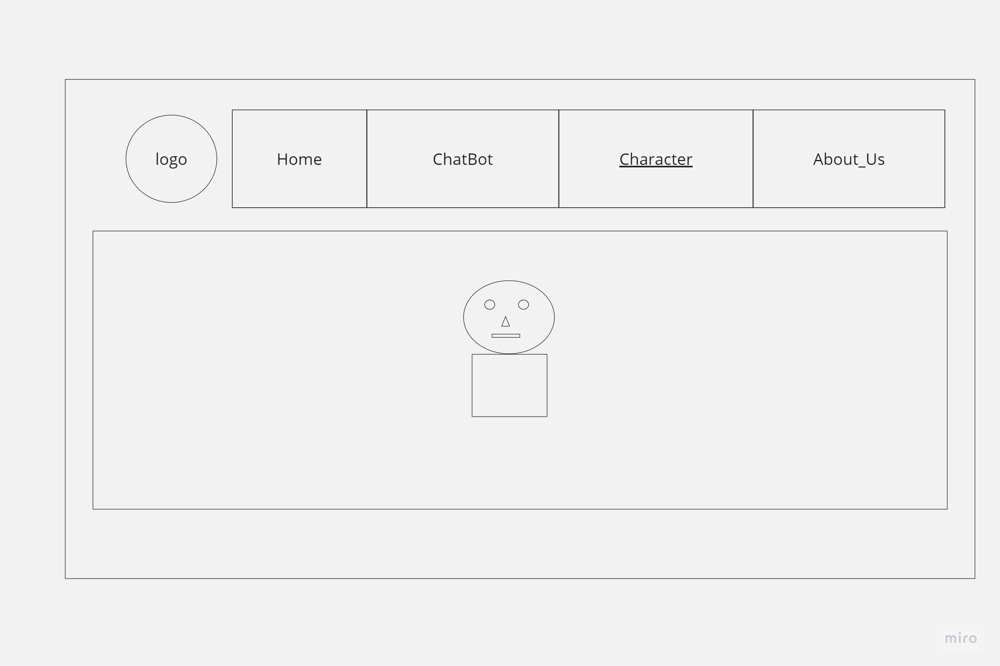
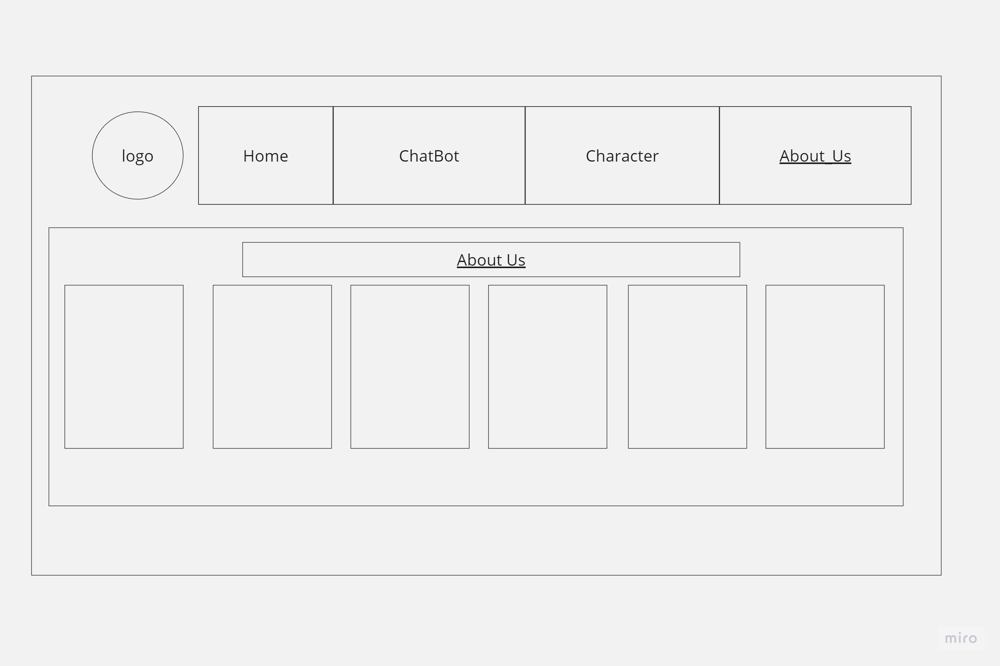
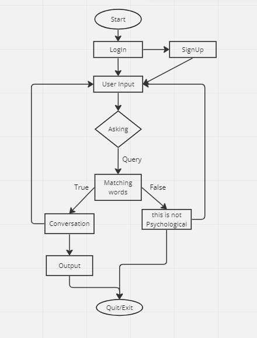
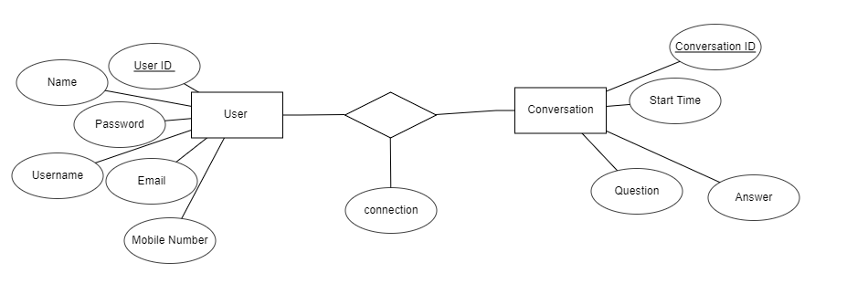

# Wireframes & Software Requirements
## Logo

## Wireframes 

## User Stories 
- 1..
  - SignUp
  - User does not have account and need to create one
  - create account in our application and give exception if he put not muched password
  - Acceptance Tests: done

- 2..
  - Login
  - User have account and need to login in our application
  - login sucsessfuly if he have account and give exception if he does not have or he put rong password
  - Acceptance Tests: done

- 3..
  - Recover Password
  - User forget her password and need to rest it
  - sending code to reset pasword on his email
  - Acceptance Tests: done

- 4..
  - Bot chat
  - User in public place and need to talk with bot in secure
  - user send the message and give the answer, in our filed
  - Acceptance Tests: done

- 5..
  - Speech to Bot
  - User need to talk in voice with bot
  - he watch the bot talking to him
  - Acceptance Tests: not done

## Software Requirements
### Vision
The vision of this project is that we can create a platform for people who want to communicate with bot to be more comfortable
. We will provide them an easy way to use their device without any problem because they don't know

## Scope (In/Out)
- IN - What will your product do:
  1. Create Chatbot Platform
  2. Provide Secure Communication between users and bots
  3. Allow Users To Talk With Bots In Voice And Texts too!
  4. Give Them A Way Of Using Device Without Any Problem Because They Don’t Know How It Works And Why?
- OUT - What will your product not do:
  1. Not Supporting Multiple Languages For Now, But Will Be Added Later On

## Functional Requirements
1. User Can Register An Account By Entering Email Address Or Phone Number which He Wants To Use As Username
2. After Registration Process Is Done Then Login Page Appears Where You Have To Put Your Credentials Like Password & Etc..
3. If Credentials Are Correct Then Dashboard Appear Which Contains All Information About Bot And Its Conversations Between Users And Bots Too...
4. There Should be a way to add new bot by clicking on the button "Add New" and then enter all details about it like name of the bot , description etc .
5. The user can also delete any existing bots from his dashboard if he wants too ...

## Data Flow

## Non-Functional Requirements
1. It should have an easy interface so that even beginners will find no difficulty in using this application
2. This project is developed with Python Programming Language, Django Framework for Web Development and MySQL Database Management System as Backend.

## Database Schema Diagram
